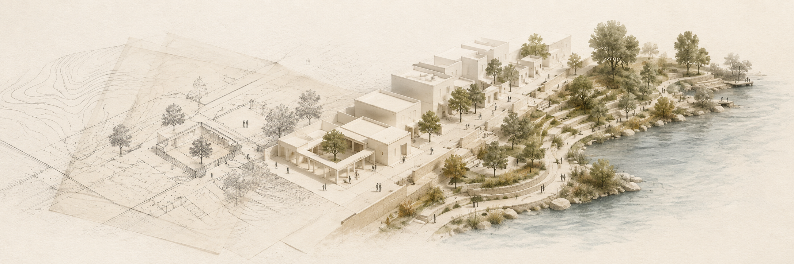
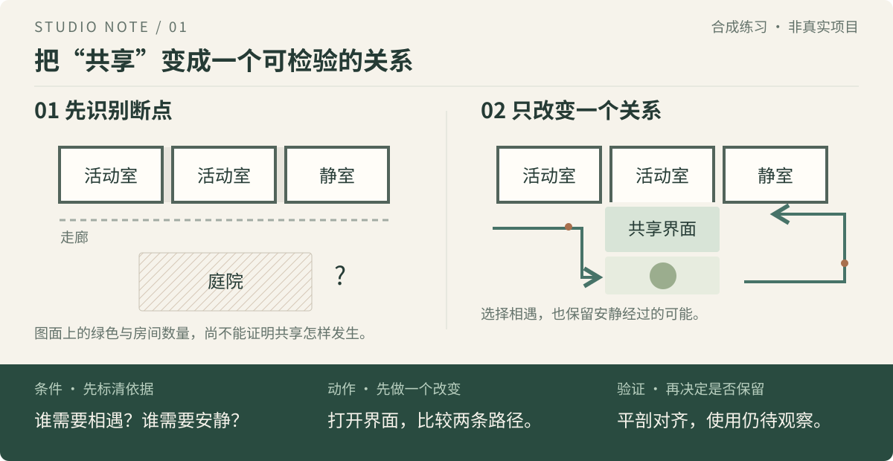

<p align="center">
  
</p>

# 设计课无敌教练

**把想法画清楚，把判断讲明白。**

面向 **建筑学 · 城乡规划 · 风景园林** 学生的开源 Agent Skill。从任务书和已有成果出发，陪你走过概念、方案、深化、评图、交图与答辩，逐渐形成自己的设计判断。

Skill 可以理解为给 AI 装上一套专门的工作方法。这个项目把设计课里的提问、推演、比较和检查整理成一套可持续使用的辅导流程，主要通过 Codex 使用。

<sub>Spatial Design Coach — From the project brief to a coherent, defensible design.</sub>

[](https://github.com/XiaoSiKe/spatial-design-coach/actions/workflows/quality.yml)
[](LICENSE)

当前发布版本：`0.6.1` · [版本记录](https://github.com/XiaoSiKe/spatial-design-coach/releases) · 封面为原创 AI 概念插画

[能帮你做什么](#what) · [开始使用](#start) · [看一个例子](#example) · [哲学与书目](#readings) · [更新与答疑](#updates) · [验证与贡献](#quality)

---

<a id="what"></a>
## 从“卡住了”到知道下一张图画什么

你可以从当前最需要帮助的地方开始。已经有方案，就直接评图；快交图了，就先整理必交成果。每一轮都会尽量说清：**问题在哪里、依据是什么、先改什么、怎样知道改好了。**

| 你现在的处境 | 教练怎样推进 | 下一步通常得到什么 |
| --- | --- | --- |
| 看完任务书，仍不知道从哪开始 | 提取要求，区分已知与未知，找到一个可设计的矛盾 | 项目卡、优先问题与第一张工作图 |
| 概念很好听，落不到平面上 | 把愿望变成关系、尺度、路径、界面或时间安排 | 一个空间动作及对应的验证图 |
| 分析图很多，方案仍没方向 | 追问哪条证据会改变决定，给出一条具体推演 | 有依据的空间策略与反证条件 |
| 几个方案总是大同小异 | 比较组织机制与价值取舍，说明各自收益和代价 | 2–3 个真正不同的方案家族 |
| 总图、剖面与模型对不上 | 沿同一路径、剖切线或基准检查上下游关系 | 有尺度、有索引的深化任务 |
| 被评图打击，不知道该信什么 | 分开评价语气、个人价值和可检验的作品问题 | 一个小而可逆的修复动作 |
| 截止期临近，工作越堆越多 | 按依赖和可用时间排出最低完整交付 | 必须完成、可降级、应停止的工作 |
| 展板混乱，答辩讲不清 | 给每张图分配论证任务，检查尺寸，模拟不同角色质询 | 叙事顺序、文件检查与答辩练习 |

**三种专业，共用一条判断链。** 建筑侧重空间、功能与构造关系；规划侧重公共生活、尺度与系统；景观侧重地形、水、植物、使用与维护。跨专业课题会沿同一个空间问题对齐这些关系。

<a id="start"></a>
## 三步开始一个设计作业

### 1. 安装完整 Skill

本机已有 Node.js 时，在终端运行：

```bash
npx skills add XiaoSiKe/spatial-design-coach \
  --skill spatial-design-coach --global --agent codex --yes
```

安装后**新建一个 Codex 任务**；如果没有出现，完全重启 Codex。在 `/skills` 中选择“设计课无敌教练”，或直接在消息中写 `$spatial-design-coach`。

<details>
<summary><strong>不熟悉终端？把这段话发给 Codex</strong></summary>

```text
请使用 $skill-installer 从下面的 GitHub 地址安装 spatial-design-coach：
https://github.com/XiaoSiKe/spatial-design-coach/tree/main/skills/spatial-design-coach

请安装完整 Skill 目录，保留 agents/、references/、scripts/ 和 assets/。
完成后告诉我安装路径，并提醒我在新任务中用 $spatial-design-coach 验证。
```

适用于带 GitHub Skill 安装能力的 Codex。其他客户端的安装方式取决于其对 [Agent Skills 规范](https://agentskills.io/specification) 或专用安装器的支持。

</details>

<details>
<summary>手动安装</summary>

```bash
git clone https://github.com/XiaoSiKe/spatial-design-coach.git
mkdir -p ~/.agents/skills
cp -R spatial-design-coach/skills/spatial-design-coach ~/.agents/skills/
```

请复制整个目录。单独复制 `SKILL.md` 会丢失参考文档、脚本、模板和界面元数据。

</details>

### 2. 为这一次作业准备一个目录

放入任务书、评分表、场地资料、已有图纸和教师反馈。CAD、BIM、Rhino、GIS 原生文件最好同时提供 PDF、PNG 或 SVG 导出，便于实际检查内容。

简单 SVG 中的源路径端点可用于核对剖切位置，避免凭画面猜坐标；图面定位与真实场地测量仍分别对待。

### 3. 在这个目录打开 Codex，开始对话

```text
$spatial-design-coach 开始这个设计作业。
请读取任务书和已有成果，建立项目状态。
指出当前最关键的设计矛盾，
并告诉我下一张图要验证什么。
```

暂时没有完整材料也可以开始。告诉教练**课题、截止时间和当前卡点**，它会标明假设，先推进一个可以回头修改的小动作。

<a id="example"></a>
## 看一个例子：让“共享”真正发生

> **学生：** 我的社区活动中心想表达“共享”，但平面还是一条走廊加几个房间。下一步怎么改？

教练先把“共享”拆成可讨论的问题：谁希望相遇，谁需要安静，哪一处空间关系可以先改变？下面是一个合成教学示意。



图 01 · 共享主张的空间转译 · [查看原图](docs/assets/concept-to-space.svg)

1. **说明依据。** 目前只有学生的描述；使用者需求和现状条件均待核实。先假设有希望交流的访客，也有需要安静经过的人。
2. **比较机制。** “走廊旁的停留口袋”改动小，但共享可能停留在边角；“向庭院打开的活动界面”联系更直接，但要付出面积、管理和声环境上的代价。
3. **做一张工作图。** 暂用 1:200 平面和同编号剖面，标出能经过、能停留、能退出的位置；比例仍以任务书为准。
4. **定义通过条件。** 平剖中的入口、共享界面与安静路径能一一对上。图纸只能证明空间关系；是否愿意停留、是否感到归属，还需要使用观察或访谈。

你决定保留哪个方向，教练记录理由、代价和下一轮验证。这个例子展示辅导方法，不代表已经完成真实设计或性能校核。

<details>
<summary><strong>再试两种专业情境：规划与景观</strong></summary>

**规划 · 分析如何改变一个空间决定**

```text
$spatial-design-coach 我做了人口、POI 和热力分析，老师说只有数据没有策略。
请从现有材料中挑一条有效证据，示范它如何影响一个具体空间动作，
并说明什么新证据会推翻这个动作。
```

教练会检查时效、粒度、覆盖、偏差和因果，避免把热力图直接变成节点与轴线。

**景观 · 生态过程怎样改变人的体验**

```text
$spatial-design-coach 我的方案叫“生态共生”，但现在只有绿地和曲线路网。
请帮我选择一个真实过程，把它连接到地形、路径、季节使用与维护，
并给出一张能检查这个机制的图。
```

例如，在明确标为假设的季节积水情境中，可以比较步道与低地的高差关系，检查日常通行如何随水位变化；储水量和真实水位仍须另行核验。

</details>

## 从一张工作图，走向完整作业

工作流由浅入深，但允许从当前卡点进入，也允许发现上游问题后回退。

| 阶段 | 先回答一个问题 | 留下可以继续工作的成果 |
| --- | --- | --- |
| **01 看清问题** | 任务要求与场地实际矛盾是什么？ | 项目卡、硬性要求、证据缺口 |
| **02 形成命题** | 为谁改变什么，愿意承担什么代价？ | 可讨论、可反驳的设计主张 |
| **03 建立依据** | 哪条事实或案例会改变这个决定？ | 条件 → 判断 → 动作 → 验证 |
| **04 生成分歧** | 还有哪些机制真正不同的回应？ | 2–3 个方案及其取舍 |
| **05 深化空间** | 关系怎样进入尺度、平面、剖面与系统？ | 可对齐、可检查的空间成果 |
| **06 评判迭代** | 当前最关键的断裂在哪里？ | 一次有通过条件的修复 |
| **07 交付答辩** | 每张图怎样证明同一套设计判断？ | 完整成果、叙事、文件检查与演练 |

### 平时学判断，紧急时保交付

| | 成长模式 | 救火模式 |
| --- | --- | --- |
| **何时使用** | 默认；按学生经验调整深度 | 明确表示紧急，或距截止时间不超过 72 小时 |
| **怎样帮助** | 提问、示范、比较、反例、复盘 | 最低完整成果、共享源图一致性、QA 与答辩三组工作包 |
| **先做什么** | 一个最小、可逆、有通过条件的动作 | 找阻塞项，保留必交内容与导出／答辩缓冲 |
| **如何确认** | 学生说明接受、拒绝或修改的理由 | 关键决定仍由学生确认；未知或未完成项如实记录 |

```text
$spatial-design-coach 还有 36 小时交图。
请读取必交成果与当前源文件，进入救火模式，
按依赖排出必须完成、可降级、应停止的工作，并保留检查和答辩时间。
```

如果你被一句评图意见卡住，也可以直接说“我不知道从哪开始”。教练会先承接这次受挫，再把作品中的具体问题拆小；人格化评价不会被当成设计结论。

<a id="readings"></a>
## 设计哲学，落实在每一次取舍里

设计会不断遇到这样的选择：为谁保留空间？怎样容纳不同的生活？什么时候需要多做，什么时候应当克制？本项目把这些问题接回可画、可讨论、可核验的设计过程。

**来源观点 → 当前矛盾 → 学生的价值取舍 → 空间动作 → 验证与复盘**

《庄子》选篇进入这条链，但保留清楚的解释边界。下列设计练习是本项目的**教学转译**，并非古籍提出的现代设计规范。

| 选篇启发 | 可以怎样用于设计学习 | 仍要检验什么 |
| --- | --- | --- |
| **《齐物论》：判断与立场** | 换到不同使用者的位置，比较同一入口或路径带来的后果 | 立场不同，不免除事实与流线冲突的检查 |
| **《养生主》：实践与限度** | 遇到阻力时放慢，把大改动拆成一个更小的试验 | 经验与直觉不能替代尺寸、构造或性能证据 |
| **《逍遥游》：重新理解有用** | 比较保留一处未规定用途的空间与立即填满功能的得失 | 谁使用、谁维护、付出什么代价，仍须说明 |

人生思考可以通过“这个方案支持怎样的生活”“这次尝试让我学会什么”展开。个人反思是可选项；学生可以只通过图纸、情境和项目例子回答。

### 本轮甄选：24 本专业著作 +《庄子》选篇

保留维护者给出的 **50 本专业参考书**，从中选出建筑、城乡规划、风景园林各 **8 本**，另加入《庄子》。以下书名均可点击进入相应的[原创方法卡](skills/spatial-design-coach/references/design-lenses.md)，查看教学动作、反例与验证边界。

**阅读记录须按实际深度理解：**

- **E · 已核读节选或前言**：24 本专业书中有 3 本，另有《庄子》选篇；范围已逐项记录。
- **M · 书介、目录或书目依据**：21 本专业书已形成方法原型，原著具体章节仍待核读。
- E 与 M 均不表示读完整部著作，行为评测也不证明文献解释正确。[版本、来源与阅读缺口](docs/research/source-map.md#selected-readings)可逐项追溯。

<details open>
<summary><strong>建筑 · 8 本｜从形式与空间，到使用、结构与场所</strong></summary>

| 编号 | 甄选著作 | 作者／主编 | 阅读记录 |
| --- | --- | --- | --- |
| B02 | [《建筑：形式、空间和秩序》](skills/spatial-design-coach/references/design-lenses.md#b02) | 程大锦 | 核心·M |
| B03 | [《建筑空间组合论》](skills/spatial-design-coach/references/design-lenses.md#b03) | 彭一刚 | 核心·M |
| B04 | [《建筑学教程1：设计原理》](skills/spatial-design-coach/references/design-lenses.md#b04) | 赫尔曼·赫茨伯格 | 核心·M |
| B06 | [《公共建筑设计原理》](skills/spatial-design-coach/references/design-lenses.md#b06) | 张文忠 | 核心·M |
| B10 | [《图解建筑结构：模式、体系与设计》](skills/spatial-design-coach/references/design-lenses.md#b10) | 程大锦等 | 核心·M |
| B17 | [《建筑的复杂性与矛盾性》](skills/spatial-design-coach/references/design-lenses.md#b17) | 罗伯特·文丘里 | 核心·E |
| B18 | [《建筑模式语言》](skills/spatial-design-coach/references/design-lenses.md#b18) | 克里斯托弗·亚历山大等 | 核心·M |
| B19 | [《场所精神：迈向建筑现象学》](skills/spatial-design-coach/references/design-lenses.md#b19) | 诺伯舒兹 | 核心·M |

</details>

<details>
<summary><strong>城乡规划 · 8 本｜从城市系统，到日常生活与历史保护</strong></summary>

| 编号 | 甄选著作 | 作者／主编 | 阅读记录 |
| --- | --- | --- | --- |
| B21 | [《城市规划原理》](skills/spatial-design-coach/references/design-lenses.md#b21) | 吴志强、李德华 | 核心·M |
| B25 | [《城市设计》](skills/spatial-design-coach/references/design-lenses.md#b25) | 王建国 | 核心·M |
| B26 | [《详细规划》](skills/spatial-design-coach/references/design-lenses.md#b26) | 阳建强 | 核心·M |
| B27 | [《乡村规划原理》](skills/spatial-design-coach/references/design-lenses.md#b27) | 李京生 | 核心·M |
| B31 | [《城市意象》](skills/spatial-design-coach/references/design-lenses.md#b31) | 凯文·林奇 | 核心·M |
| B32 | [《美国大城市的死与生》](skills/spatial-design-coach/references/design-lenses.md#b32) | 简·雅各布斯 | 核心·M |
| B33 | [《交往与空间》](skills/spatial-design-coach/references/design-lenses.md#b33) | 扬·盖尔 | 核心·E |
| B35 | [《历史城市保护学导论》](skills/spatial-design-coach/references/design-lenses.md#b35) | 张松 | 核心·M |

</details>

<details>
<summary><strong>风景园林 · 8 本｜从场地与形式，到自然过程与维护</strong></summary>

| 编号 | 甄选著作 | 作者／主编 | 阅读记录 |
| --- | --- | --- | --- |
| B37 | [《景观设计学：场地规划与设计手册》](skills/spatial-design-coach/references/design-lenses.md#b37) | 约翰·O·西蒙兹、巴里·W·斯塔克 | 核心·M |
| B39 | [《从概念到形式》](skills/spatial-design-coach/references/design-lenses.md#b39) | 格兰特·W·里德 | 核心·M |
| B41 | [《中国古典园林分析》](skills/spatial-design-coach/references/design-lenses.md#b41) | 彭一刚 | 核心·M |
| B42 | [《园冶注释》](skills/spatial-design-coach/references/design-lenses.md#b42) | 计成著，陈植注释 | 核心·M |
| B45 | [《设计结合自然》](skills/spatial-design-coach/references/design-lenses.md#b45) | 伊恩·麦克哈格 | 核心·M |
| B47 | [《植物造景》](skills/spatial-design-coach/references/design-lenses.md#b47) | 苏雪痕 | 核心·M |
| B49 | [《风景园林工程》](skills/spatial-design-coach/references/design-lenses.md#b49) | 孟兆祯 | 核心·M |
| B50 | [《城市绿地系统规划》](skills/spatial-design-coach/references/design-lenses.md#b50) | 许浩 | 核心·E |

</details>

| 编号 | 甄选著作 | 作者／主编 | 阅读记录 |
| --- | --- | --- | --- |
| Z01 | [《庄子》选篇](skills/spatial-design-coach/references/design-lenses.md#z01) | 传统归于庄周及后学 | 哲学·E |

<details>
<summary><strong>完整书目续表 · 其余 26 本专题参考书</strong></summary>

以下保留原清单编号，尚未列入本轮核心蒸馏。作者／主编沿用维护者提供的书目；后续按项目需要核验版次并选章研究。

| 编号 | 甄选著作 | 作者／主编 | 阅读记录 |
| --- | --- | --- | --- |
| B01 | 《建筑初步》 | 田学哲、郭逊 | 专题参考 |
| B05 | 《图解思考：建筑表现技法》 | 保罗·拉索 | 专题参考 |
| B07 | 《住宅建筑设计原理》 | 龙灏等 | 专题参考 |
| B08 | 《建筑构造》上、下册 | 覃琳、翁季等 | 专题参考 |
| B09 | 《建筑物理》 | 柳孝图 | 专题参考 |
| B11 | 《建筑设计资料集》 | 中国建筑学会、中国建筑工业出版社组织编写 | 专题参考 |
| B12 | 《中国建筑史》 | 潘谷西 | 专题参考 |
| B13 | 《外国建筑史：十九世纪末叶以前》 | 陈志华 | 专题参考 |
| B14 | 《外国近现代建筑史》 | 罗小未 | 专题参考 |
| B15 | 《华夏意匠：中国古典建筑设计原理分析》 | 李允鉌 | 专题参考 |
| B16 | 《走向新建筑》 | 勒·柯布西耶 | 专题参考 |
| B20 | 《总体设计》 | 凯文·林奇、加里·海克 | 专题参考 |
| B22 | 《国土空间规划原理》 | 吴志强 | 专题参考 |
| B23 | 《中国城市建设史》 | 董鉴泓 | 专题参考 |
| B24 | 《外国城市建设史》 | 沈玉麟 | 专题参考 |
| B28 | 《城市道路与交通规划》上、下册 | 徐循初 | 专题参考 |
| B29 | 《城市工程系统规划》 | 戴慎志 | 专题参考 |
| B30 | 《城市与区域规划空间分析实验教程》 | 尹海伟、孔繁花 | 专题参考 |
| B34 | 《城市更新理论与方法》 | 阳建强 | 专题参考 |
| B36 | 《风景园林概论》 | 丁绍刚 | 专题参考 |
| B38 | 《风景园林设计要素》 | 诺曼·K·布思 | 专题参考 |
| B40 | 《中国古典园林史》 | 周维权 | 专题参考 |
| B43 | 《西方园林史：19世纪之前》 | 朱建宁、赵晶 | 专题参考 |
| B44 | 《西方现代景观设计的理论与实践》 | 王向荣、林箐 | 专题参考 |
| B46 | 《景观生态学：格局、过程、尺度与等级》 | 邬建国 | 专题参考 |
| B48 | 《园林树木学》 | 陈有民 | 专题参考 |

</details>

## 让作业可以连续推进

每项作业使用独立目录。教练只在其中的 `studio/` 维护状态与派生产物，保留原始任务书、图纸、模型、照片和数据。

```text
studio/
├── PROJECT.md          # 当前要求、决定、证据、成果与下一步
└── outputs/
    ├── working/        # 草稿、派生文件、外援返回与新版本
    └── final/          # 通过要求、版本与文件检查的提交成果
```

`PROJECT.md` 是唯一项目状态。已确认的设计选择、图纸是否完成、结论是否经过验证会分别记录；完成一张图不会自动证明一个判断。

只读环境会用会话状态继续工作，并给出可复制的续航快照。换任务前可以这样说：

```text
$spatial-design-coach 请导出项目续航快照，
保留已确认的要求、决定、证据缺口和下一张图的通过条件，让我在新任务继续。
```

### 需要专业工具时，带着问题移交

需要 GIS、CAD／BIM、日照分析、图像生成、展板或 PDF 制作时，教练会发现当前环境已有的专门能力，并移交设计目的、源文件、锁定决定、输出目录和验收标准。返回后再检查来源、方法、验证证据及其空间后果。

没有合适工具时，会明确说明本次操作未完成，提供移交单、人工路径和验收清单。待验证的结论会继续保留这个状态。

<a id="updates"></a>
## 更新与常见问题

GitHub 仓库、本地安装副本、正在使用的任务上下文和作业状态是四个不同层次。**更新后请新建任务加载新版；已有作业不会自动迁移。**

<details>
<summary><strong>如何更新已安装的 Skill</strong></summary>

用户级安装：

```bash
npx skills update spatial-design-coach --global --yes
```

项目级安装：

```bash
npx skills update spatial-design-coach --project --yes
```

使用 `npx skills list --global --json` 查看安装范围和 GitHub 来源；实际版本以完整 Skill 中 `SKILL.md` 的 `metadata.version` 为准。更新后新建任务，仍未发现新版时完全重启 Codex。

手动安装的副本没有可靠来源记录：先备份原目录，再用最新 Release 的完整 `skills/spatial-design-coach/` 替换，随后新建任务。

</details>

<details>
<summary><strong>如何检查与迁移已有作业</strong></summary>

先在作业目录执行只读检查：

```bash
python3 ~/.agents/skills/spatial-design-coach/scripts/migrate_project.py \
  --root . --check --json
```

审阅结果并明确同意迁移后，才执行：

```bash
python3 ~/.agents/skills/spatial-design-coach/scripts/migrate_project.py \
  --root . --apply --json
```

迁移前会备份 `studio/PROJECT.md`，保留已有内容，不修改学生原始资料。安装位置不同时，请使用 `npx skills list --global --json` 返回的实际路径。

`legacy` 表示缺少状态格式标记，可先检查；`future-schema` 表示当前 Skill 不支持较新的状态格式，应先更新 Skill，暂不写入项目状态。本次 `0.6.1` 沿用 schema 1。

</details>

<details>
<summary><strong>安装后如何做一次最小验证</strong></summary>

新建 Codex 任务，在一个可写的临时空目录输入：

```text
$spatial-design-coach 开始这个设计作业。
当前目录是可写测试沙盒，请初始化项目状态，不改动目录外的文件。
```

应只创建 `studio/PROJECT.md`、`studio/outputs/working/` 和 `studio/outputs/final/`；再次运行应继续已有作业，保留学生修改。

</details>

<details>
<summary>没有生效、命令不对或出现两个同名 Skill？</summary>

| 现象 | 处理方式 |
| --- | --- |
| 安装或更新后当前对话仍没变化 | 新建任务；必要时完全重启 Codex |
| 更新命令找不到来源 | 常见于手动复制安装；备份后用 `npx skills add` 重新安装完整目录 |
| 只有 `SKILL.md` | 补装完整目录，包括 `agents/`、`references/`、`scripts/` 与 `assets/` |
| `/spatial-design-coach` 无效 | 使用 `/skills` 选择，或在消息中写 `$spatial-design-coach` |
| 同名 Skill 出现两次 | 检查项目级与用户级是否都安装了副本；它们不会自动合并 |

仓库包含 Codex Plugin manifest，目前未提交公共 Plugin Directory。学生使用优先选择本页的独立 Skill 安装方式。

</details>

<a id="quality"></a>
## 验证、边界与共同改进

本项目用合成设计情境检查辅导行为，也检查 Skill 能否完整安装、作业状态能否安全续接。测试方法和结果的含义分别说明，避免把“达到复跑门槛”误当作“所有必需项通过”。

| 检查层次 | 覆盖内容 |
| --- | --- |
| **仓库与安装** | 版本、文档链接、书目对应、Skill／Plugin 格式、安装发现与逐文件比对 |
| **状态操作** | 初始化幂等、原件保护、备份迁移与未来 schema 拒绝写入 |
| **行为评测** | 30 个单轮情境；18 个高风险情境额外复跑两次；9 个多轮作业各跑三次，共 93 次判定 |
| **发布条件** | 默认要求全部通过；维护者明确验收例外时，在 Release 中披露实际验证范围、失败与未完成项，保留原始结果 |

普通 GitHub CI 执行静态验证、确定性测试与队列检查；模型行为评测另行实际运行。具体标准见[验收情境](docs/testing/acceptance-scenarios.md)，复现方式见[行为评测说明](tests/evals/README.md)。

教练协助你形成和检验判断，关键设计决定与最终提交责任属于学生。不伪造调研、引用、性能或完成文件；生成图像要标明性质，课程要求的 AI 使用记录应按课程规定披露。“无敌”是给你打气，成绩与专业合规仍取决于实际成果和相应审查。

想参与改进，可以提交一个具体的失败情境、一条可复现的测试或一个经过核验的方法修订。

[贡献指南](CONTRIBUTING.md) · [维护者文档](docs/README.md) · [共同术语](CONTEXT.md) · [来源与许可](docs/research/provenance.md) · [图像与示意图说明](docs/assets/README.md)

---

[MIT License](LICENSE) © 2026 XiaoSiKe
